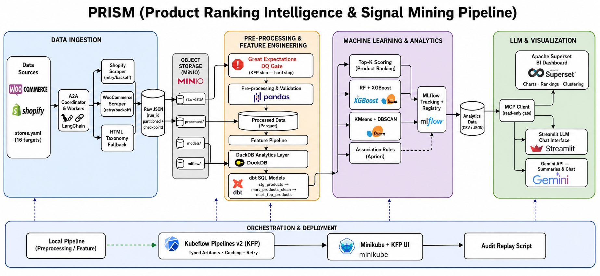
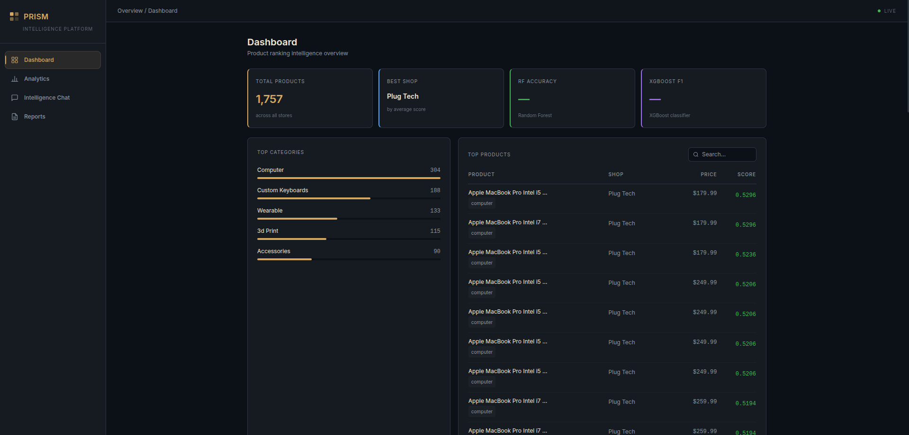
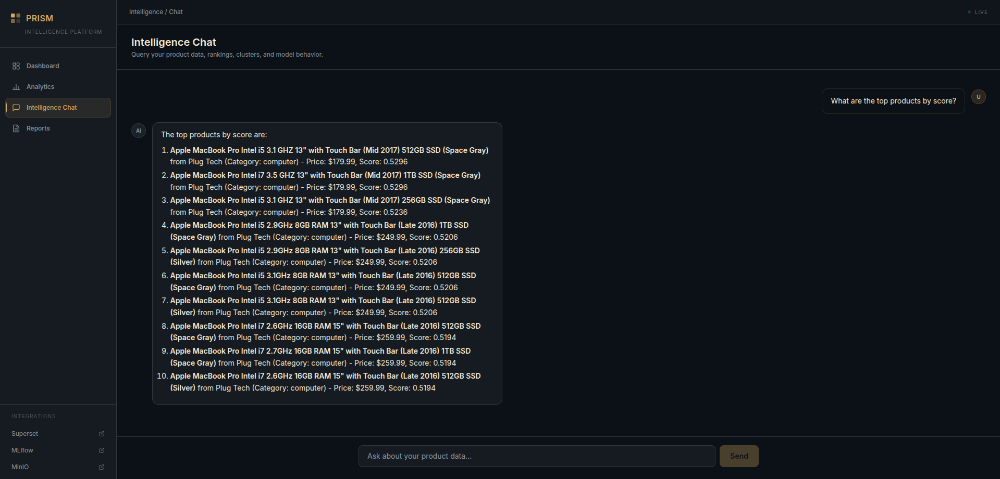
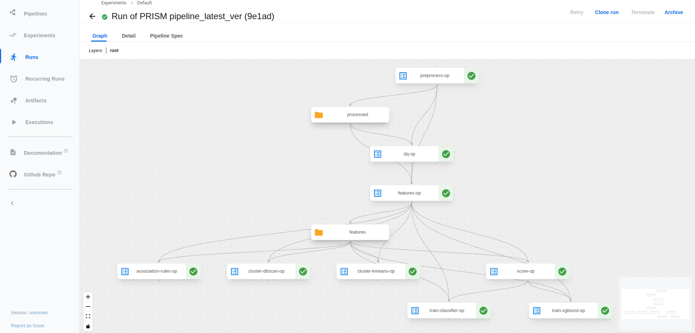
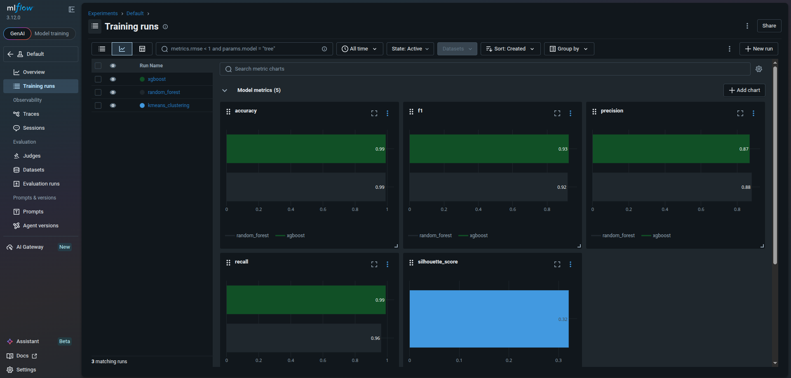
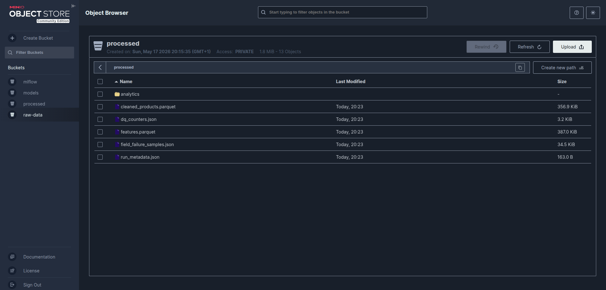
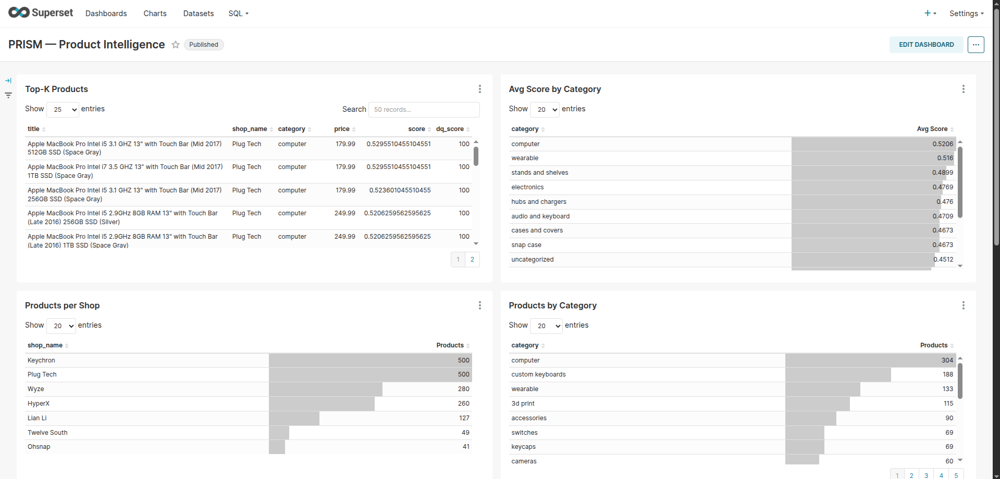

# PRISM — Product Ranking Intelligence & Signal Mining Pipeline

**Author:** Mohamed El Gorrim  
**Repo:** [MedGm/Smart-eCommerce-Intelligence-Pipeline-v2](https://github.com/MedGm/Smart-eCommerce-Intelligence-Pipeline-v2)

End-to-end ML pipeline: scrapes 1,757 products from 8 e-commerce stores → validates with Great Expectations → engineers features → scores by potential → trains RF + XGBoost classifiers, KMeans + DBSCAN clustering, Apriori association rules → serves a FastAPI + SPA dashboard with live Gemini LLM chat. Orchestrated via Kubeflow Pipelines v2 on Minikube, with MinIO object storage and MLflow experiment tracking.



---

## Screenshots

| Dashboard | Intelligence Chat |
|-----------|------------------|
|  |  |

| Kubeflow Pipeline | MLflow Experiments |
|-------------------|--------------------|
|  |  |

| MinIO Storage | Superset BI |
|---------------|-------------|
|  |  |

---

## Stack

| Layer | Technology |
|---|---|
| Scraping | `requests` — Shopify JSON API + WooCommerce REST API v3 |
| Store config | `stores.yaml` (7 Shopify · 1 WooCommerce) |
| Object storage | MinIO (buckets: `raw-data`, `processed`, `models`, `mlflow`) |
| Preprocessing | `pandas`, `pyarrow` |
| Data quality | Great Expectations (schema, price range, dq_score validation) |
| Feature engineering | Price normalization, TF-IDF, categorical encoding |
| ML / Data mining | scikit-learn (RF, KMeans, DBSCAN), XGBoost, mlxtend (Apriori) |
| Experiment tracking | MLflow 3.12.0 (SQLite backend + MinIO artifacts) |
| Analytics warehouse | DuckDB (`warehouse.duckdb`, 6 tables) |
| REST API | FastAPI + uvicorn (SSE streaming, `/api/stats`, `/api/chat`, etc.) |
| Dashboard | HTML + Tailwind CSS + Alpine.js SPA (no build step) |
| BI | Apache Superset (connected to DuckDB warehouse) |
| LLM | Google Gemini 2.5 Flash (`google-genai`) |
| Orchestration | Kubeflow Pipelines v2 on Minikube (9 typed components) |
| Infra | Docker Compose, Minikube, Kustomize |
| CI / Lint | GitHub Actions, Ruff, pytest (145 tests) |

---

## Architecture

```
Shopify (7 stores) + WooCommerce (1 store)
    │
    ▼  raw JSON
MinIO — raw-data bucket
    │
    ▼
KFP: preprocess_op     ← Great Expectations DQ gate + pandas clean
    │  cleaned_products.parquet → MinIO processed/
    ▼
KFP: features_op       ← price norm + TF-IDF + encoding
    │  features.parquet → MinIO processed/
    ├──► score_op       → topk_products.csv, topk_per_category.csv, topk_per_shop.csv
    ├──► train_classifier_op  (RF)      → MLflow + MinIO models/
    ├──► train_xgboost_op     (XGBoost) → MLflow + MinIO models/
    ├──► cluster_kmeans_op    (KMeans)  → clusters.csv
    ├──► cluster_dbscan_op    (DBSCAN)  → dbscan_clusters.csv
    └──► association_rules_op (Apriori) → association_rules.csv
                │
                ▼  all CSVs → MinIO processed/analytics/
           make refresh     ← downloads CSVs from MinIO → rebuilds warehouse.duckdb
                │
    ┌───────────┴────────────┐
    ▼                        ▼
FastAPI SPA (port 8501)   Apache Superset (port 8088)
Dashboard · Chat · Reports   BI dashboards
    │
    ▼
Gemini 2.5 Flash  ← enriched context: top-20 products + shop rankings
```

---

## Quick start

Everything runs inside Docker — no local Python install needed.

```bash
# 1. Build the app image
make build

# 2. Start infrastructure (MinIO + MLflow)
make infra-up

# 3. Run the full local pipeline
make pipeline

# 4. Rebuild warehouse (syncs MinIO → local → DuckDB)
make refresh

# 5. Launch the dashboard
make dashboard          # http://localhost:8501
```

For Gemini LLM features, create a `.env` file:

```
GEMINI_API_KEY=your_key_here
```

---

## Service URLs

| Service | URL | Credentials |
|---|---|---|
| PRISM Dashboard | http://localhost:8501 | — |
| Apache Superset | http://localhost:8088 | admin / admin |
| MinIO Console | http://localhost:9001 | minioadmin / minioadmin |
| MinIO S3 API | http://localhost:9000 | — |
| MLflow | http://localhost:5000 | — |
| KFP UI (Minikube) | http://localhost:8080 | — |

---

## Kubeflow pipeline

```bash
# Compile the pipeline YAML
make compile-kfp

# Then upload kubeflow_prism_pipeline.yaml to http://localhost:8080
# After all pods finish green:
make refresh            # sync MinIO analytics → rebuild warehouse.duckdb
```

Each KFP pod is ephemeral — downloads inputs from MinIO at start, uploads outputs at end. Host MinIO reachable at `192.168.49.1:9000` (Minikube gateway).

---

## Makefile targets

| Target | Description |
|---|---|
| `make build` | Build Docker app image |
| `make test` | pytest (145 tests) inside container |
| `make lint` | Ruff check + format |
| `make scrape` | Scrape all 8 stores |
| `make preprocess` | Preprocessing + DQ validation |
| `make features` | Feature engineering |
| `make score` | Top-K scoring |
| `make train` | All ML models (RF, XGBoost, KMeans, DBSCAN, Apriori) |
| `make pipeline` | Full end-to-end local run |
| `make pipeline-full` | Full pipeline wired to MinIO + MLflow |
| `make infra-up` | Start MinIO + MLflow |
| `make infra-down` | Stop infrastructure |
| `make dashboard` | Launch FastAPI SPA on port 8501 |
| `make refresh` | Sync MinIO analytics → rebuild warehouse.duckdb |
| `make warehouse` | Rebuild DuckDB warehouse only |
| `make compile-kfp` | Compile Kubeflow pipeline YAML |
| `make clean` | Remove pycache / pytest cache |

---

## Repository structure

```
smart-ecommerce-pipeline-v2/
├── data/
│   ├── raw/              # scraped JSON partitioned by store
│   ├── processed/        # cleaned Parquet, features, DQ outputs
│   └── analytics/        # scoring CSVs, cluster outputs, model metrics
├── docs/
│   ├── diagrams/         # architecture.png
│   └── screenshots/      # dashboard, KFP, MLflow, MinIO, Superset
├── manifests/            # Kustomize overlays (Kubeflow / Minikube)
├── src/
│   ├── api/              # FastAPI app + routes (analytics, llm)
│   ├── dashboard/        # static/ — SPA (index.html, Tailwind + Alpine.js)
│   ├── scraping/         # Shopify + WooCommerce scrapers, stores loader
│   ├── preprocessing/    # clean, validate, DQ counters
│   ├── features/         # feature engineering
│   ├── scoring/          # explainable Top-K formula
│   ├── ml/               # RF, XGBoost, KMeans, DBSCAN, Apriori, PCA
│   ├── llm/              # Gemini summarizer, prompts, MCP client
│   ├── storage/          # MinIO client, DuckDB warehouse (rebuild_warehouse)
│   └── pipeline/         # local runner + KFP v2 pipeline (9 components)
├── tests/                # 145 unit + integration tests
├── stores.yaml           # store catalog — edit here to add/remove targets
├── Makefile
├── Dockerfile
├── Dockerfile.mlflow
├── Dockerfile.superset
├── docker-compose.yml
├── kubeflow_prism_pipeline.yaml
└── requirements.txt
```

---

## Key design decisions

**Explainable scoring** — each product score is a weighted sum of normalised signals (price competitiveness, rating, availability, recency). Weights documented in `src/scoring/topk.py`.

**KFP pod isolation** — every Kubeflow component downloads its inputs from MinIO at startup and uploads outputs before exit. No shared filesystem between pods.

**Full warehouse rebuild** — `make refresh` / `rebuild_warehouse()` downloads all analytics CSVs from MinIO and builds 6 DuckDB tables (`products`, `topk_products`, `topk_per_category`, `topk_per_shop`, `clusters`, `association_rules`). The FastAPI and Superset both read from this single warehouse file.

**SSE streaming chat** — LLM responses stream token-by-token via Server-Sent Events. The context sent to Gemini includes the top-20 products, shop rankings, and per-category leaders from the live warehouse.

**Store config in YAML** — `stores.yaml` is the single place to add or remove scraping targets. No Python changes needed.

**Minikube-only deployment** — no cloud dependency. Everything (KFP, MinIO, Superset, MLflow) runs locally.

---

## License

Academic project — Mohamed El Gorrim, UAE University.
