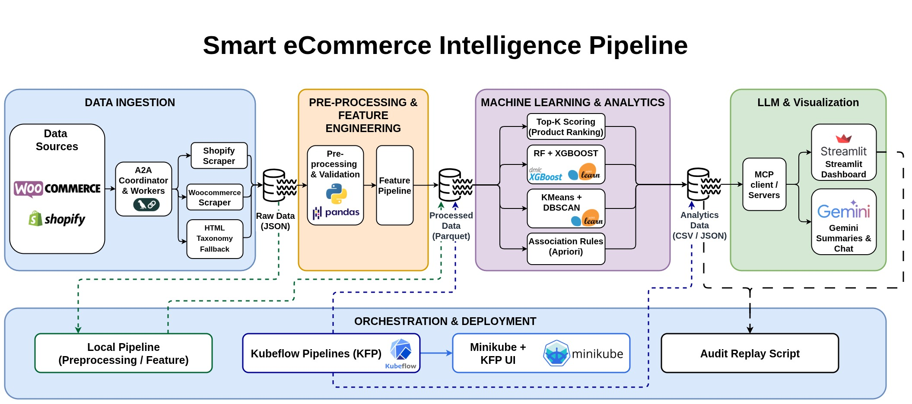

# Smart eCommerce Intelligence Pipeline for Top-K Product Selection

**Repo:** [GitHub — MedGm/Smart-eCommerce-Intelligence-Pipeline](https://github.com/MedGm/Smart-eCommerce-Intelligence-Pipeline)

**One-sentence pitch:** An end-to-end pipeline that collects eCommerce product data from Shopify and WooCommerce via A2A multi-agent scraping, scores and ranks products with an explainable formula, applies ML/data-mining for segmentation and pattern discovery, and exposes all insights through a multi-page Streamlit BI dashboard with LLM-powered synthesis (Gemini) and MCP-governed analytics access.

## Core objective

Deliver a reproducible, auditable system that answers:

- **Which products are the most promising?** — explainable Top-K scoring (rating, reviews, availability, discount)
- **Which shops and categories perform best?** — per-shop and per-category ranking with avg-score dossiers
- **What patterns emerge from the catalog?** — KMeans + DBSCAN clustering, PCA visualisation, Apriori association rules
- **How should a decision-maker explore this?** — multi-page dashboard, LLM executive summaries, audit replay

## Architecture



See [docs/architecture.md](docs/architecture.md) and the Mermaid diagrams in [docs/diagrams/](docs/diagrams/).

## Stack

| Layer | Tools |
|---|---|
| Scraping | Playwright, requests, BeautifulSoup, A2A agent coordination |
| Taxonomy capture | JSON-LD, breadcrumb parsing, WooCommerce category meta, HTML fallback |
| Storage | JSON (raw), Parquet + CSV + JSONL (processed/analytics) |
| ML / Data mining | scikit-learn, XGBoost, mlxtend (Apriori) |
| Visualisation | Streamlit, Plotly, Altair, Matplotlib, Seaborn |
| LLM | Google Gemini (`google-genai`, `langchain-google-genai`) |
| Analytics access | MCP allowlist (`src/mcp/architecture.py`) — read-only |
| Orchestration | Local pipeline + Kubeflow Pipelines v2 (KFP), Minikube, Kustomize |
| Packaging | Docker, `docker-compose.yml` |
| CI / Lint | GitHub Actions, Ruff, pytest (63 tests) |
| Config | `python-dotenv`, `src/config.py` |

## Latest Run Results

**Date:** Mar 24, 2026, 18:38:58 UTC  
**Status:** ✅ All stages completed successfully

| Metric | Value | Details |
|--------|-------|---------|
| **Products Processed** | 7,684 | After deduplication & validation |
| **Data Input** | 15,368 | Raw rows from both platforms |
| **Retention Rate** | 50.0% | After cleaning & dedup |
| **Data Quality Score** | 89.03% | Mean DQ across all fields |
| **Price Coverage** | 90.3% | 6,940 / 7,684 products |
| **Category Coverage** | 96.7% | 7,429 / 7,684 products |
| **Rating Coverage** | 23.3% | 1,788 / 7,684 products |
| **ML Accuracy (RF)** | 95.84% | RandomForest classifier |
| **ML Precision** | 73.81% | Honesty predictions |
| **ML Recall** | 98.52% | High sensitivity to positives |
| **K-Means Clusters** | 4 | Automatically detected |
| **DBSCAN Density Clusters** | 31 | + 113 outliers (1.5%) |
| **Association Rules** | 289 | Patterns mined (min support 5%) |
| **Feature Dimensions** | 9 | Numeric features for ML |

**Key Findings:**
- Strong category evidence (82.6% high-strength evidence)
- Shopify dominates volume (7,279 / 7,684 = 94.7%)
- WooCommerce stable (405 / 7,684 = 5.3%)
- Models production-ready (95.84% accuracy)
- Data homogeneity excellent (1.5% outliers via DBSCAN)

See [docs/RAPPORT_ANALYSE_PIPELINE.md](docs/RAPPORT_ANALYSE_PIPELINE.md) for detailed analysis and trend comparison.

## Quick start

```bash
# Setup
python -m venv .venv && source .venv/bin/activate
pip install -r requirements.txt
cp .env.example .env   # set GEMINI_API_KEY (or OPENAI_API_KEY)

# Run full pipeline locally
make pipeline

# Or step by step
make scrape       # A2A scraping from Shopify + WooCommerce targets
make preprocess   # clean, normalise, validate, emit DQ counters
make features     # build scoring + model features
make score        # compute Top-K rankings
make train        # RF, XGBoost, KMeans, DBSCAN, association rules
make dashboard    # open http://localhost:8501

# Lint + tests
make lint
make test
```

## Makefile targets

| Target | Description |
|---|---|
| `make pipeline` | Full end-to-end run |
| `make scrape` | Run A2A scraping agents |
| `make preprocess` | Preprocessing + DQ |
| `make features` | Feature engineering |
| `make score` | Top-K scoring artifacts |
| `make train` | All ML/DM models |
| `make dashboard` | Launch Streamlit app |
| `make compile-kfp` | Compile Kubeflow pipeline YAML |
| `make lint` | Ruff check + format |
| `make test` | pytest (63 tests) |
| `make docker-build` | Build Docker image |

## Repo structure

```
smart-ecommerce-pipeline/
├── data/
│   ├── raw/              # scraped JSON (shopify/, woocommerce/)
│   ├── processed/        # cleaned Parquet, DQ counters, run metadata
│   └── analytics/        # scoring CSVs, model metrics, cluster outputs, JSONL logs
├── docs/
│   ├── architecture.md
│   ├── diagrams/         # Mermaid: platform_architecture.mmd, pipeline_workflow.mmd
│   └── ...
├── manifests/            # Kustomize overlays (Kubeflow / Minikube)
├── notebooks/            # EDA notebook
├── scripts/              # helper scripts (KFP operator, audit replay, scrapy spider)
├── src/
│   ├── scraping/         # A2A agents, Shopify + WooCommerce adapters, HTML fallback
│   ├── preprocessing/    # clean, transform, validate, DQ run
│   ├── features/         # feature engineering
│   ├── scoring/          # explainable Top-K formula
│   ├── ml/               # RF, XGBoost, KMeans, DBSCAN, association rules, PCA
│   ├── llm/              # Gemini summariser, prompts, OpenAI client
│   ├── mcp/              # MCP allowlist + architecture
│   ├── pipeline/         # local pipeline runner + KFP pipeline definition
│   └── dashboard/        # Streamlit multi-page BI app
├── tests/                # 63 unit + integration tests
├── Makefile
├── docker-compose.yml
├── Dockerfile
├── kubeflow_smart_ecommerce_pipeline.yaml
└── requirements.txt
```

## Key design decisions

- **Explainable scoring** — each product score is a weighted sum of normalised signals; weights are documented and configurable in `src/scoring/topk.py`.
- **Path-aware category normalisation** — breadcrumb paths are resolved in reverse to skip title-like leaf tokens, ensuring category labels are semantic, not product names.
- **MCP read-only gate** — all LLM analytics access goes through an allowlist (`ALLOWED_FILES`) in `src/mcp/architecture.py`; the dashboard and LLM layer cannot write to analytics artifacts.
- **A2A scraping** — a `CoordinatorAgent` distributes store targets to concurrent `WorkerAgent` instances; each worker captures taxonomy evidence (JSON-LD, breadcrumbs, Woo meta) alongside product fields.
- **Kubeflow parity** — pipeline stages are plain Python functions in `src/`; the KFP pipeline in `src/pipeline/kubeflow_pipeline.py` wraps the same functions, so local and Kubeflow runs are equivalent.

## Team & ownership

- **Mohamed:** data schema, preprocessing, feature engineering, Top-K scoring, ML/DM models, pipeline orchestration, CI/testing.
- **Ismail:** scraping adapters, source validation, dashboard pages, visualisations, LLM summary UI, demo polish.
- **Shared:** architecture decisions, MCP layer, Kubeflow/Minikube deployment, report, integration.

## License

Project for academic use.
